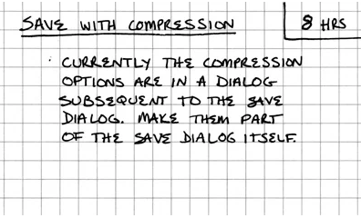

# 6.4.2 Stakeholder Needs and Requirements Definition Process
## 1. Prepare for Stakeholder Needs and Requirements Definition
### a. Identify the stakeholders who have an interest in the software system throughout its lifecycle.
#### a. 'a'
#### b. Extreme programming talks about sutomer input which I feel can be directly relate to stakeholder needs; "Visionary customers can be part of quarterly and weekly planning. They can have a budget, a percentage of the available development capacity, to do with as they please."
#### c. We talked about who could possibly be using the app and threw aroud the idea of making a campus wide survey to get opinions of some stakeholders.
### b. Define the stakeholder needs and requirements definition strategy.
#### a. 'd'
#### b. In extreme programming, stakeholder needs and requirements are defined using stories. "Early estimation is a key difference between stories and other requirements practices."
#### c. We are creating stories and using planning poker to provide early estimation.
### c. Identify and plan for the necessary enabling systems or services needed to support stakeholder needs and requirements definition.
#### a. 'h'
#### b. 
#### c. We talked to our client to figure out the most optimal serices to use for the time being and we have begun to think about when we need to upscale, what services to swap/migrate to,
### d. Obtain or acquire access to the enabling systems or services to be used.
#### a. 'h'
#### b. 
#### c. This was relatively simple for us as all the services are free except for the AWS server. We just had to make accounts and sign up for API keys and whatever we needed.

## 2. Define Stakeholder Needs
### a. Define context of use within the concept of operations and the preliminary life cycle concepts.
#### a. 'b' 
#### b. 
#### c. In our project, the context of use is defined during our meetings meetings with out client. We talk about how our system will be used and implemented in real life. This helps us make sure the system will fit into normal operations and works well with other systems in general.
### b. Identify stakeholder needs.
#### a. 'd'
#### b. Beck says to identify stakeholder needs through stories, "On an XP team, interaction designers work with customers, helping to write and clarify stories."
#### c. We meet with our client, who is a stakeholder, weekly to create stories.
### c. Prioritize and down-select needs.
#### a. 'e'
#### b. In XP, the customer selects the stories thay would like implemented. "Our customer picked the minimal functionality for a first deployment."
#### c. We talk to out client weekly and get her impression of what we should be doing next to meet her goals.
### d. Define the stakeholder needs and rationale.
#### a. 'd'
#### b. In a story, rationale is included as well as needs. 
#### c. Out stories use a currently... given... when... then... format which includes stakeholder needs and rationale.

## 3. Develop the Operational Concept and Other Life Cycle Concepts
### a. Define a representative set of scenarios to identify the required capabilities that correspond to anticipated operational and other life cycle concepts.
#### a. 
#### b. 
#### c. In our project, we writeuser stories based on real-world use cases.
### b. Identify the factors affecting interactions between the users and the system.
#### a. 
#### b. 
#### c. In our project, we have a sort of continuous feedback loop with out client. We will give her the most recent version of the app, then get her feedback, implement that feedback and repeat.

## 4. Transform Stakeholder Needs Into Stakeholder Requirements
### a. Identify the constraints on a system solution.
#### a. 'c'
#### b. 
#### c. This is a big issue in our project, especially when it comes to the finance integration. We need to follow all guidelines and restraints of storage of personal information, which is quite difficult. We also realize out current database is not going to be able to be upscaled well to a production build.
### b. Identify the stakeholder requirements and functions that relate to critical quality characteristics, such as assurance, safety, security, environment, or health.
#### a. 
#### b. 
#### c. Our project includes a CI pipeline. This pipeline will eventually check safety and security of sensitive data as well as just make sure we are using good coding standards.

# 6.4.4 Architecture Definition Process
## 1. Prepare for Architectural Definition
### a. Review pertinent information and identify key drivers of the architecture.
#### a. 
#### b. 
#### c. 
### b. Identify stakeholder concerns.
#### a. 
#### b. 
#### c. 
### c. Define the architecture definition roadmap, approach, and strategy.
#### a. 
#### b. 
#### c. 
### d. Define architecture evaluation criteria based on stakeholder concerns and key requirements.
#### a. 
#### b. 
#### c. 
### e. Identify and plan for the necessary enabling systems or services needed to support the architecture definition process.
#### a. 
#### b. 
#### c. 
### f. Obtain or acquire access to the enabling systems or services to be used.
#### a. 
#### b. 
#### c. 

## 2. Develop Architectural Viewpoints
### a. Select, adapt, or develop viewpoints and model kinds based on stakeholder concerns.
#### a. 
#### b. 
#### c. 
### b. Establish or identify potential architecture frameworks to be used in developing models and views.
#### a. 
#### b. 
#### c. 
### c. Capture rationale for selection of frameworks, viewpoints, and model kinds.
#### a. 
#### b. 
#### c. 
### d. Select or develop supporting modeling techniques and tools.
#### a. 
#### b. 
#### c. 

## 3. Develop Models and Views of Candidate Architecture
### a. Define the software system context and boundaries in terms of interfaces and interactions with external entities.
#### a. 
#### b. 
#### c. 
### b. Identify architectural entities and relationships between entities that address key stakeholder concerns and critical software system requirements.
#### a. 
#### b. 
#### c. 
### c. Allocate concepts, properties, characteristics, behaviors, functions, or constraints that are significant to architecture decisions of the software system to architectural entities.
#### a. 
#### b. 
#### c. 
### d. Select, adapt, or develop models of the candidate architectures of the software system.
#### a. 
#### b. 
#### c. 
### e. Compose views from the models in accordance with identified viewpoints to express how the architecture addresses stakeholder concerns and meets stakeholder and system/software requirements.
#### a. 
#### b. 
#### c. 
### f. Harmonize the architecture models and views with each other.
#### a. 
#### b. 
#### c. 

## 4. Relate the Architecture to Design
### a. Identify software system elements that relate to architectural entities and the nature of these relationships.
#### a. 
#### b. 
#### c. 
### b. Define the interfaces and interactions among the software system elements and external entities.
#### a. 
#### b. 
#### c. 
### c. Partition, align, and allocate requirements to architectural entities and system elements.
#### a. 
#### b. 
#### c. 
### d. Map software system elements and architectural entities to design characteristics.
#### a. 
#### b. 
#### c. 
### e. Define principles for the software system design and evolution.
#### a. 
#### b. 
#### c. 

## 5. Assess Architecture Candidates
### a. Assess each candidate architecture against constraints and requirements.
#### a. 
#### b. 
#### c. 
### b. Assess each candidate architecture against stakeholder concerns using evaluation criteria.
#### a. 
#### b. 
#### c. 
### c. Select the preferred architectures and capture key decisions and rationale.
#### a. 
#### b. 
#### c. 
### d. Establish the architecture baseline of the selected architecture.
#### a. 
#### b. 
#### c. 

## 6. Manage the Selected Architecture
### a. Formalize the architecture governance approach and specify governance-related roles and responsibilities, accountabilities, and authorities related to design, quality, security, and safety.
#### a. 
#### b. 
#### c. 
### b. Obtain explicit acceptance of the architecture by stakeholders.
#### a. 
#### b. 
#### c. 
### c. Maintain concordance and completeness of the architectural entities and their architectural characteristics.
#### a. 
#### b. 
#### c. 
### d. Organize, assess, and control evolution of the architecture models and views to help ensure that the architectural intent is met and the architectural vision and key concepts are correctly implemented.
#### a. 
#### b. 
#### c. 
### e. Maintain the architecture definition and evolution strategy.
#### a. 
#### b. 
#### c. 
### f. Maintain traceability of the architecture.
#### a. 
#### b. 
#### c. 
### g. Provide key artifacts and information items that have been selected for baselines.
#### a. 
#### b. 
#### c. 

# 6.4.5 Design Definition Process
## 1. Prepare for Software System Design Definition.
### a. Define the design definition strategy, consistent with the selected life cycle model and anticipated design artifacts.
#### a. 
#### b. 
#### c. 
### b. Select and prioritize design principles and design characteristics.
#### a. 
#### b. 
#### c. 
### c. Identify and plan for the necessary enabling systems or services needed to support design definition.
#### a. 
#### b. 
#### c. 
### d. Obtain or acquire access to the enabling systems or services to be used.
#### a. 
#### b. 
#### c. 

## 2. Establish Designs Related to Each Software System Element.
### a. Transform architectural and design characteristics into the design of software system elements.
#### a. 
#### b. 
#### c. 
### b. Define and prepare or obtain the necessary design enablers.
#### a. 
#### b. 
#### c. 
### c. Examine design alternatives and feasibility of implementation.
#### a. 
#### b. 
#### c. 
### d. Refine or define the interfaces among the software system elements and with external entities.
#### a. 
#### b. 
#### c. 
### e. Establish the design artifacts.
#### a. 
#### b. 
#### c. 

## 3. Assess Alternatives for Obtaining Software System Elements.
### a. Determine technologies required for each element composing the software system.
#### a. 
#### b. 
#### c. 
### b. Identify candidate alternatives for the software system elements.
#### a. 
#### b. 
#### c. 
### c. Assess each candidate alternative against criteria developed from expected design characteristics and element requirements to determine sustainability for the intended application.
#### a. 
#### b. 
#### c. 
### d. Choose the preferred alternatives among candidate design solutions for the software system elements.
#### a. 
#### b. 
#### c. 

## 4. Manage the Design.
### a. Capture the design and rationale.
#### a. 
#### b. 
#### c. 
### b. Establish traceability between the detailed design elements, the system/software requirements, and the architectural entities of the software system architecture.
#### a. 
#### b. 
#### c. 
### c. Determine the status of the software system and element design.
#### a. 
#### b. 
#### c. 
### d. Provide key artifacts and information items that have been selected for baselines.
#### a. 
#### b. 
#### c. 
